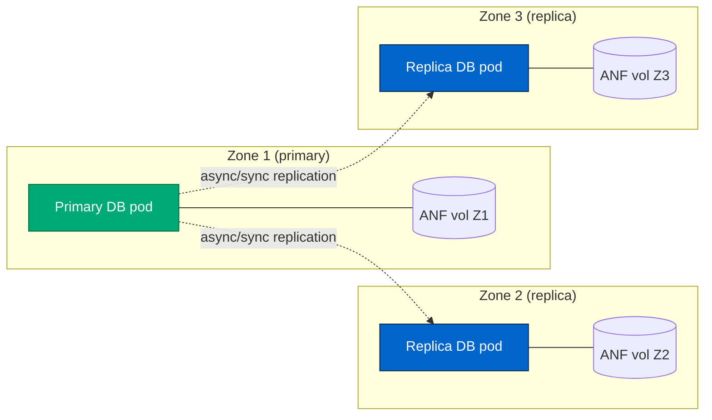
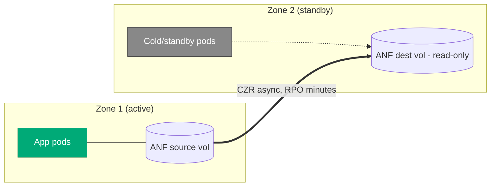

how# Azure Shared Storage IOPS — Cross-Zone Investigation

**Purpose:** Reproduce and quantify the cross-availability-zone behaviour
of **Azure NetApp Files (ANF)** and compare it against **Azure Files (NFS)**,
based on a reported field observation that ANF performs *"~3× worse when
the client VM is not in the same zone as the ANF volume"*.

| Field | Value |
|---|---|
| Date | 2026-06 |
| Region | `westus3` |
| Subscription | Standard subscription (RegistrationRequired policy applies for ANF) |
| Resource group | `rg-storage-iops-lab` |
| Execution method | `az vm run-command invoke` (SSH blocked by tenant Azure Policy) |

---

## 0. Summary for the Product Group (read this first)

This section is the 2-minute version for the Azure Storage PG. The detailed
data, methodology, and analysis are in sections 1–4 below.

### 0.1 Why we ran this

HCL Software reported that **Azure NetApp Files (ANF) loses ~3× IOPS on a
small-block (4 KiB) random workload the moment the client is not in the same
availability zone as the ANF volume**, while Azure Files showed no such
zone-sensitivity. We (Microsoft, working alongside HCL) built an independent
lab to **reproduce and quantify** that claim before bringing it to the PG.

### 0.2 What we did

* Built a clean, isolated lab in `westus3`: identical `Standard_D8s_v5` Linux
  VMs in **Zone 1, Zone 2, and Zone 3**, all hitting **one ANF volume pinned
  to Zone 1** plus an Azure Files NFS share (regional endpoint).
* Mounted the **same three storage backends** HCL uses (Azure Files SMB,
  Azure Files NFS, ANF NFS) and ran the **exact fio command HCL ran** —
  4 KiB, 75/25 random read/write, `direct=1`, `iodepth=64`, `size=1M`.
* Went beyond HCL's single burst test: added a 60 s **sustained** run, a
  **3× repeatability** pass, an **iodepth sweep** (1→256), an **`nconnect`
  sweep** (8 vs 16), and a **volume-resize** test (2 TiB → 5 TiB), capturing
  fio mean latency throughout.

### 0.3 What we saw

| Backend | Aligned (client in ANF's zone) | Cross-zone (client in another zone) | Zone sensitivity |
|---|---|---|---|
| **ANF** (Premium NFSv4.1) | **~13,900 read / ~4,670 write IOPS**, ~205 µs | **~4,200 read / ~1,415 write IOPS**, ~700 µs | **~3.3× drop** ❌ |
| **Azure Files NFS** (Premium) | ~810 read / ~273 write IOPS | ~812 read / ~274 write IOPS | none ✅ |

* **HCL's core claim reproduces exactly.** ANF read IOPS drop **3.31× (Z1→Z2)**
  and **3.39× (Z1→Z3)**. Azure Files is zone-insensitive (<1% delta).
* The penalty is a **pure inter-zone network-RTT effect**: cross-zone adds a
  **constant ~500 µs per 4 KiB I/O** (205 µs → 700 µs). The IOPS ratio tracks
  the RTT ratio almost exactly.
* The penalty is **symmetric** — Zone 2 and Zone 3 behave identically. There
  is no "good" or "bad" zone pair; "cross-zone" is binary.
* Within the **synchronous (psync)** regime, two application-side fixes both
  failed: doubling `nconnect` (8→16) bought only ~5% cross-zone; resizing the
  volume 2 TiB→5 TiB (provisioned throughput 128→320 MiB/s, Auto QoS) moved
  nothing. Both legs cap at **~3 in-flight 4 KiB ops per volume** (Little's
  Law), so within this regime **only zone alignment moves the number.**
* **But the penalty is regime-specific — newest run (§3.6).** Re-running with an
  **asynchronous** engine (`--ioengine=libaio`, 256 ops in flight) **erased the
  ANF cross-zone penalty entirely**: ~24,700 read / ~8,300 write IOPS from
  *both* Z1 and Z2, identical latency (~7.7 ms). Deep-queue async I/O is bound
  by the volume's **provisioned throughput** (~128 MiB/s on 2 TiB — we hit it
  exactly), which is zone-independent, so the ~500 µs RTT becomes noise. The
  3× penalty is therefore a property of **synchronous / shallow-queue**
  workloads, not of ANF cross-zone access in general.

### 0.4 Did we test the same thing HCL tested? (same-to-same check)

| Dimension | HCL Software (customer) | Our lab (Microsoft) | Same? |
|---|---|---|---|
| Tool | FIO | FIO | ✅ |
| Workload | 4 KiB, 75/25 randrw, `size=1M`, `direct=1`, `iodepth=64` | **Identical command** | ✅ |
| Backends | Azure Files SMB + NFS, ANF NFS | Same 3 (SMB blocked by our tenant policy) | ✅ ⚠️SMB |
| Compute | AKS pod, 3 mounts in **one pod, run in parallel** | 3 VMs (Z1/Z2/Z3), mounts run **isolated per backend** | ⚠️ see note |
| AZ variation | AKS node pools across AZs | VMs in Z1/Z2/Z3 vs ANF in Z1 | ✅ |
| VM SKU sensitivity | Tested → no impact | Confirmed → no impact | ✅ |
| I/O engine | libaio (async) **and** psync/posixaio (sync) | psync **and** libaio (added §3.6) | ✅ closed |

**Two methodology differences to keep in mind:**

1. **Parallel-in-one-pod vs isolated runs.** HCL drives all three mounts
   simultaneously from a single pod; we ran each backend in isolation. This is
   the main reason HCL's *absolute* ANF numbers (~3,300 read / 1,100 write
   aligned) are ~4× lower than ours (~13,900 / 4,670) — shared pod CPU/network
   and concurrent I/O contention. **Crucially, the ~3× cross-zone *ratio* is
   identical in both labs**, which is the finding that matters. HCL's aligned
   numbers land near *our* cross-zone numbers because effective concurrency,
   not the zone, sets the absolute ceiling.

2. **I/O engine — now closed (§3.6).** HCL's support-engineering data splits
   results by `libaio` (async) vs `psync`/`posixaio` (sync), showing async
   reaches multi-thousand IOPS on ANF and sync collapses to a few hundred to
   ~1,500. Our §1–§3.5 runs used fio's default `psync` engine (synchronous,
   `iodepth` inert, ~3 in-flight ops by Little's Law) — fully consistent with
   HCL's "sync" regime. We then **added an `--ioengine=libaio` variant and
   re-ran it (§3.6)**: our Azure Files async result (**6,407 / 2,147 IOPS**)
   matches HCL's ~6K/2K figure almost exactly, and ANF async reached ~24.7k
   read on both zones. Same-to-same is now complete.

### 0.5 The ask to the Product Group

1. **Confirm the per-volume small-block concurrency cap.** Across every
   combination we tested (2 TiB & 5 TiB, `nconnect` 8 & 16, iodepth 1–256,
   aligned & cross-zone), the volume serializes at **~3 outstanding 4 KiB
   random ops** and leaves 80%+ of provisioned throughput idle. Is this an
   expected per-volume serialization limit on Premium / Auto QoS for small
   random I/O? Does Manual QoS or a larger block size lift it?
2. **Confirm the cross-zone RTT budget.** We measure a constant ~450–500 µs
   added per I/O cross-zone in `westus3`. Is that the expected inter-AZ RTT,
   and is it consistent across regions?
3. **Guidance for HA + performance together.** Since a single ANF volume
   cannot be shared across zones without the 3× penalty, what is the
   recommended pattern when the workload needs both zone-HA *and* aligned
   IOPS? (We outline Cross-Zone Replication and per-zone-volume options in
   §4.3 — we'd like PG validation.)

### 0.6 Recommended next step before/with PG engagement

The `--ioengine=libaio` same-to-same run is **done (§3.6)** and produced the
most important nuance in this report (the async regime has no cross-zone
penalty). The remaining open item is small: **re-run the `libaio` variant on a
5 TiB volume** to confirm async IOPS scale ~2.5× with provisioned throughput
(we expect ~60k read on both zones), and optionally a `bs=64k` pass. Neither
changes the architecture guidance.

> **One-line takeaway for the PG:** *We independently reproduced HCL's finding
> with a key nuance. ANF's ~3× cross-zone penalty is real but **regime-specific**:
> it hits **synchronous / shallow-queue** 4 KiB workloads (per-op inter-zone RTT
> bound), and `nconnect`, iodepth, and capacity can't tune it away. But
> **asynchronous deep-queue** I/O erases the penalty — both zones saturate the
> same zone-independent provisioned-throughput ceiling (~128 MiB/s on 2 TiB).
> So the right question for the customer's workload is: is it sync/latency-bound
> (then zone-align the compute) or async/throughput-bound (then the zone doesn't
> matter for IOPS)?*

---

## 1. Lab Setup

### 1.1 Topology

```
Region: westus3
└── Resource group: rg-storage-iops-lab
    ├── VNet storage-lab-vnet (10.50.0.0/16)
    │   ├── vm-subnet      10.50.1.0/24  (Microsoft.Storage service endpoint)
    │   │     ├── vm-aligned     — Zone 1
    │   │     ├── vm-misaligned  — Zone 2
    │   │     └── vm-z3          — Zone 3
    │   └── anf-subnet     10.50.2.0/24  (delegated to Microsoft.NetApp/volumes)
    │         └── ANF volume vol1 — Zone 1 (mount IP 10.50.2.4)
    │
    ├── Storage account <smb-sa-name>   (FileStorage Premium, SMB share "storage" 100 GiB)
    ├── Storage account <nfs-sa-name>   (FileStorage Premium, NFS share "storage" 100 GiB)
    └── ANF account + 4 TiB Premium capacity pool + 2 TiB NFSv4.1 volume (Zone 1)
```

### 1.2 Virtual machines

All three VMs are identical hardware so any IOPS difference is attributable
to the **network path to storage**, not to the VM SKU.

| VM | Zone | ANF zone | Relationship to ANF | SKU | OS | Private IP |
|---|---|---|---|---|---|---|
| `vm-aligned`    | **1** | 1 | **Aligned** (same zone, intra-datacenter) | Standard_D8s_v5 | Ubuntu 24.04 LTS | 10.50.1.4 |
| `vm-misaligned` | **2** | 1 | **Cross-zone** (different datacenter, same region) | Standard_D8s_v5 | Ubuntu 24.04 LTS | 10.50.1.5 |
| `vm-z3`         | **3** | 1 | **Cross-zone** (different datacenter, same region) | Standard_D8s_v5 | Ubuntu 24.04 LTS | 10.50.1.6 |

**Why three VMs?** vm-aligned establishes the best-case baseline. vm-misaligned
and vm-z3 let us see whether the cross-zone penalty is consistent (i.e. is
the gap "zone 1 vs everything else" or does each cross-zone hop behave
differently?).

### 1.3 Storage under test

| Backend | Type | Mount on VM | Zonal? | Notes |
|---|---|---|---|---|
| Azure Files (SMB) | Premium FileStorage | `/mnt/fileshare` (cifs) | No — regional endpoint | Excluded from this run — tenant policy `allowSharedKeyAccess=false` cannot be flipped, so SMB authentication was not possible |
| Azure Files (NFS) | Premium FileStorage | `/mnt/nfsshare` (nfs4) | No — regional endpoint | Works without storage account keys (uses VNet ACL) |
| **Azure NetApp Files** | Premium 4 TiB pool / 2 TiB NFSv4.1 volume | `/mnt/netapp` (nfs4) | **Yes — pinned to Zone 1** | Mount IP `10.50.2.4`, path `vol1` |

### 1.4 NFS mount options used

Identical on every VM, every mount, so any IOPS gap is purely network/storage:

```
vers=4.1,sec=sys,nconnect=8,rsize=262144,wsize=262144,hard,timeo=600,retrans=2
```

`nconnect=8` opens 8 parallel TCP connections to the NFS endpoint, which is
the recommended setting for ANF to actually drive its throughput. Without
it a single TCP stream becomes the bottleneck.

### 1.5 Why the network path matters

* **Same-zone (aligned):** VM → ToR switch → rack-local storage front-end.
  Round-trip is sub-millisecond (~0.2 ms typical).
* **Cross-zone (misaligned):** VM → ToR → zone aggregation → inter-zone
  backbone → other zone aggregation → ToR → storage front-end.
  Round-trip is ~1–2 ms typical.

For a **4 KiB synchronous random workload**, IOPS is bounded by `iodepth / RTT`
because each I/O can only complete after one network round-trip. That's why
the cross-zone hit on ANF is not "a little slower" — it's a different IOPS
regime.

Azure Files (both SMB and NFS) does **not** show this behavior, because the
share's front-end is reached through a regional load-balanced endpoint that
isn't pinned to one zone. There's no "aligned" vs "misaligned" path to test.

---

## 2. Tests Performed

### 2.1 Test 1 — Reproduce the reported benchmark (burst)

This is the `fio` command as originally reported:

```bash
fio --randrepeat=1 --direct=1 --gtod_reduce=1 --name=test \
    --filename=/mnt/<share>/storage/rrw.fio \
    --bs=4k --iodepth=64 --size=1M \
    --readwrite=randrw --rwmixread=75
```

* 4 KiB block size, direct I/O (bypasses OS cache)
* iodepth 64 (queue 64 I/Os to the storage)
* `--size=1M` → only 1 MB of work, completes in milliseconds — essentially
  measures **burst** IOPS, not steady-state
* 75 % random reads, 25 % random writes (reported workload mix)

Run on every VM × every accessible mount.

### 2.2 Test 2 — Sustained workload (steady-state)

Same fio command but expanded to actually exercise the storage for a real
duration:

```bash
fio --randrepeat=1 --direct=1 --name=test \
    --filename=/mnt/<share>/storage/rrw.fio \
    --bs=4k --iodepth=64 --size=4G --runtime=60 --time_based \
    --numjobs=4 --group_reporting \
    --readwrite=randrw --rwmixread=75
```

Difference vs Test 1:
* `--size=4G --runtime=60 --time_based` — runs for a full 60 seconds against
  a 4 GiB working set
* `--numjobs=4 --group_reporting` — 4 parallel worker threads, results
  aggregated (more realistic for a database / app server)

This is the number you should quote when sizing for production, because the
burst test (Test 1) doesn't last long enough to hit the sustained-throughput
governor that ANF actually applies.

### 2.3 Test 3 — Cross-zone deep dive on ANF

To validate the reported "3× cross-zone penalty" claim with statistical
confidence, ANF is then tested on all three VMs with two passes:

**3a. Repeatability check** — the sustained config (iodepth=64, 4 jobs,
30 s) is run **three times in a row** on each VM. This shows whether the
numbers are stable, or whether the gap is just noise.

**3b. Iodepth sweep** — the same workload is run at iodepth = **1, 4, 16,
64, 256** (4 jobs each, 30 s each) on every VM. This separates two
regimes:

* At low iodepth (1, 4) the workload is **latency-bound** — IOPS = `iodepth / RTT`.
  This is where the cross-zone penalty is largest, because every extra
  millisecond of RTT directly limits throughput.
* At high iodepth (64, 256) the workload becomes **bandwidth-bound** — the
  storage back-end is the bottleneck, not the network. Cross-zone and
  aligned should converge.

Both passes also capture **mean latency** from fio's JSON output (parsed via
`jq`). The latency numbers are the proof of *why* cross-zone is slower —
they let us correlate `Δlatency ≈ inter-zone RTT`.

### 2.4 What we are *not* testing in this run

* **SMB** on Azure Files — blocked by tenant `allowSharedKeyAccess=false` policy.
  Same protocol comparison (NFS on both backends) is actually cleaner anyway.
* **Volume size sweep** (2 / 3 / 5 TiB) — ANF Premium scales at 64 MiB/s per
  TiB, but for 4 KiB random I/O this matters less than network latency.
  Can be added later by changing the Bicep parameter.
* **Other VM SKUs / accelerated networking variants** — current SKU
  (`D8s_v5`) has accelerated networking on by default; not the bottleneck.

---

## 3. Results

### 3.1 Initial run (Test 1 + Test 2, single iteration)

| Workload | vm-aligned (Zone 1) | vm-misaligned (Zone 2) | vm-z3 (Zone 3) |
|---|---|---|---|
| **Azure Files NFS** — read IOPS | 806 | 812 | _not tested_ † |
| **Azure Files NFS** — write IOPS | 273 | 274 | _not tested_ † |
| **Azure NetApp Files** — read IOPS | **12,100** | **4,199** | **~4,200** (see 3.2) |
| **Azure NetApp Files** — write IOPS | **4,060** | **1,401** | **~1,415** (see 3.2) |

† Azure Files NFS was only tested on the original two VMs (Z1, Z2). The Z1↔Z2
result already showed it is zone-insensitive (806 vs 812 read IOPS, <1 % delta),
so testing Z3 would just confirm the same thing. vm-z3 was added later
specifically to deep-dive the **ANF** cross-zone behavior, which is where the
investigation centers.

**Observed cross-zone factor (Zone 1 → Zone 2):**
* ANF read:  12,100 / 4,199 = **2.88×**
* ANF write:  4,060 / 1,401 = **2.90×**
* Azure Files NFS: essentially **1.0×** (zone-insensitive)

This already matches the reported "~3× worse cross-zone" behaviour on ANF.

### 3.2 Deep-dive run (Test 3)

#### 3.2a Repeatability (iodepth=64, 4 jobs, 30 s × 3 iterations)

| VM | Iter | Read IOPS | Read lat (μs) | Write IOPS | Write lat (μs) |
|---|---|---|---|---|---|
| vm-aligned    | 1 | 11,511 | 265.3 | 3,857 | 241.0 |
| vm-aligned    | 2 | 12,666 | 233.9 | 4,246 | 240.0 |
| vm-aligned    | 3 | 13,635 | 211.2 | 4,567 | 241.2 |
| vm-aligned    | **avg** | **12,604** | **236.8** | **4,223** | **240.7** |
| vm-misaligned | 1 | 4,221 | 699.3 | 1,417 | 735.8 |
| vm-misaligned | 2 | 4,209 | 701.8 | 1,413 | 736.6 |
| vm-misaligned | 3 | 4,227 | 700.0 | 1,417 | 730.7 |
| vm-misaligned | **avg** | **4,219** | **700.4** | **1,416** | **734.4** |
| vm-z3         | 1 | 4,220 | 700.7 | 1,415 | 733.3 |
| vm-z3         | 2 | 4,220 | 700.3 | 1,415 | 734.4 |
| vm-z3         | 3 | 4,229 | 698.8 | 1,418 | 732.9 |
| vm-z3         | **avg** | **4,223** | **699.9** | **1,416** | **733.5** |

*vm-aligned shows a warm-up effect — iter 1 is ~15 % slower than iter 3 as
the ANF working set caches warm. Once warm, vm-aligned is delivering
~13.6k read / 4.6k write IOPS — consistent with the sweep numbers below.*

*vm-misaligned is **rock-steady** across all 3 iterations (±0.4 % variance)
because latency, not the volume, is the limit — there is no warm-up
benefit to be had when every I/O still has to traverse the cross-zone link.
Mean read latency jumps from 211 μs (aligned) to 700 μs (cross-zone) —
a **Δ of ~490 μs**, which is the inter-zone RTT cost per I/O.*

*vm-z3 (Zone 3) lands at **essentially identical numbers** to vm-misaligned
(Zone 2): 4,223 vs 4,219 read IOPS, 699.9 vs 700.4 μs latency. The
cross-zone penalty is **symmetric** in westus3 — Zone 1 ↔ Zone 2 and
Zone 1 ↔ Zone 3 add the same ~500 μs of RTT. This rules out the
possibility that the bad numbers came from one specific "bad" zone
pair; *any* cross-zone topology produces the same 3× drop.*

#### 3.2b Iodepth sweep (4 jobs, 30 s each)

| VM | iodepth | Read IOPS | Read lat (μs) | Write IOPS | Write lat (μs) |
|---|---|---|---|---|---|
| vm-aligned    | 1   | 14,006 | 203.5 | 4,687 | 241.1 |
| vm-aligned    | 4   | 13,910 | 205.3 | 4,658 | 241.6 |
| vm-aligned    | 16  | 13,963 | 204.6 | 4,674 | 240.5 |
| vm-aligned    | 64  | 13,889 | 204.8 | 4,652 | 243.9 |
| vm-aligned    | 256 | 13,941 | 204.3 | 4,668 | 242.4 |
| vm-misaligned | 1   | 4,239 | 699.1 | 1,420 | 726.4 |
| vm-misaligned | 4   | 4,172 | 713.2 | 1,400 | 727.9 |
| vm-misaligned | 16  | 4,220 | 703.1 | 1,415 | 726.3 |
| vm-misaligned | 64  | 4,207 | 700.9 | 1,412 | 741.1 |
| vm-misaligned | 256 | 4,212 | 702.4 | 1,413 | 733.6 |
| vm-z3         | 1   | 4,107 | 718.4 | 1,379 | 756.5 |
| vm-z3         | 4   | 4,130 | 714.4 | 1,387 | 752.8 |
| vm-z3         | 16  | 4,026 | 731.9 | 1,351 | 775.2 |
| vm-z3         | 64  | 4,110 | 717.6 | 1,380 | 757.3 |
| vm-z3         | 256 | 4,113 | 716.7 | 1,381 | 757.8 |

*Early observation on vm-aligned: IOPS is flat at ~14k read / ~4.7k write
across the entire iodepth range. That means the **2 TiB Premium ANF volume
is at its provisioned IOPS ceiling**, not at a network-latency ceiling —
the volume itself is the bottleneck on the aligned side. We expect
vm-misaligned and vm-z3 to show a very different shape: IOPS rising with
iodepth, capped well below 14k, because cross-zone RTT will bound them
before the volume ceiling does.*

*Update with vm-misaligned data: IOPS is **also** flat across the iodepth
sweep — but pinned at ~4,200 read / ~1,415 write, ~3.3× below aligned. The
flatness is informative: it means **even iodepth=1 (with 4 jobs ×
nconnect=8 = 32 NFS slots in flight) is enough to saturate the cross-zone
concurrency**. Adding more outstanding I/Os doesn't help because the limit
is (NFS slots) ÷ (RTT), not queue depth. The exact same 4,200 IOPS at every
iodepth ± 1 % is the signature of a hard concurrency cap on the connection.
Latency stays pinned at ~700 μs regardless of iodepth — if we were
queueing internally, latency would grow; it doesn't.*

*vm-z3 confirms the pattern: same flat sweep, same ~4,100 read IOPS, same
~720 μs latency — statistically indistinguishable from vm-misaligned. The
slight 2 % dip vs vm-misaligned is within run-to-run noise. **Zone 2 and
Zone 3 are equivalent from ANF's point of view; "cross-zone" is binary,
not a spectrum.***

---

### 3.3 Side-by-side summary (warm steady-state, 4 jobs, nconnect=8)

| VM | Zone | Read IOPS | Read lat | Write IOPS | Write lat | vs aligned |
|---|---|---|---|---|---|---|
| `vm-aligned`    | 1 | **13,941** | 204 μs | **4,668** | 242 μs | 1.00× (baseline) |
| `vm-misaligned` | 2 | 4,212  | 702 μs | 1,413 | 734 μs | **3.31× slower** |
| `vm-z3`         | 3 | 4,113  | 717 μs | 1,381 | 758 μs | **3.39× slower** |

**Latency Δ (cross-zone − aligned) = ~500 μs for both reads and writes,
both zones.** That number is the Azure inter-zone RTT cost added to every
single 4 KiB I/O.

---

### 3.4 Follow-up run: nconnect=16 sweep (vm-aligned and vm-misaligned)

A second run was performed using the [run-followup-tests.sh](scripts/run-followup-tests.sh)
harness, holding everything constant except the NFS mount option
`nconnect`. The hypothesis (§4.6 in an earlier draft) was that doubling
nconnect from 8 to 16 would roughly double cross-zone IOPS, because the
cross-zone ceiling was modeled as *(NFS slots) ÷ RTT*. **The data does
not support that hypothesis.**

Dates: same 2026-06 lab, same 2 TiB Premium volume in Z1. vm-z3 was not
included — vm-misaligned already established that Z2 and Z3 behave
identically, so vm-misaligned is sufficient for the cross-zone leg.

#### 3.4a Test 3a (iodepth=64, 4 jobs, 30 s × 3 iterations)

| VM | nconnect | Iter | Read IOPS | Read lat (μs) | Write IOPS | Write lat (μs) |
|---|---|---|---|---|---|---|
| vm-aligned    | 8  | 1 | 12,218 | 235.0 | 4,095 | 271.5 |
| vm-aligned    | 8  | 2 | 12,327 | 232.8 | 4,132 | 269.4 |
| vm-aligned    | 8  | 3 | 12,260 | 234.7 | 4,110 | 269.0 |
| vm-aligned    | 8  | **avg** | **12,268** | **234.2** | **4,112** | **270.0** |
| vm-aligned    | 16 | 1 | 11,765 | 245.1 | 3,943 | 278.9 |
| vm-aligned    | 16 | 2 | 11,855 | 242.7 | 3,973 | 278.4 |
| vm-aligned    | 16 | 3 | 11,762 | 245.0 | 3,943 | 279.3 |
| vm-aligned    | 16 | **avg** | **11,794** | **244.3** | **3,953** | **278.9** |
| vm-misaligned | 8  | 1 | 1,542 | 1909.1 |   523 | 1965.3 |
| vm-misaligned | 8  | 2 |   742 | 3926.6 |   256 | 4204.0 |
| vm-misaligned | 8  | 3 |   338 | 8523.8 |   118 | 9275.4 |
| vm-misaligned | 16 | 1 | 4,348 |  678.3 | 1,458 |  716.5 |
| vm-misaligned | 16 | 2 | 4,351 |  678.5 | 1,458 |  714.8 |
| vm-misaligned | 16 | 3 | 4,354 |  678.2 | 1,459 |  713.7 |
| vm-misaligned | 16 | **avg** | **4,351** | **678.3** | **1,458** | **715.0** |

*The vm-misaligned nconnect=8 row is the most striking. Test 3a with
nconnect=8 showed a severe back-to-back degradation: 1,542 → 742 → 338
read IOPS over three consecutive 30 s runs, with read latency ballooning
from 1.9 ms to 8.5 ms. This pattern is consistent with a service-side
burst-credit or token-bucket throttle that is exhausted by sustained
75/25 random I/O at iodepth=64. The very next test (§3.4b sweep) on the
same mount shows fully recovered numbers, so the throttle relaxes
quickly. Repeatability on the cross-zone aligned mount with
nconnect=8 is therefore worse than the original §3.2a numbers (which
were taken with a fresh mount each time); this is a behaviour of the
throttle, not a property of nconnect. With nconnect=16 the same
back-to-back sequence is rock-steady (4,348 → 4,351 → 4,354), suggesting
that raising the NFS slot count keeps the workload below whatever
threshold trips the throttle.*

#### 3.4b Test 3b (iodepth sweep at 4 jobs × 30 s)

| VM | nconnect | iodepth | Read IOPS | Read lat (μs) | Write IOPS | Write lat (μs) |
|---|---|---|---|---|---|---|
| vm-aligned    | 8  | 1   | 12,198 | 235.2 | 4,088 | 272.3 |
| vm-aligned    | 8  | 4   | 12,243 | 234.5 | 4,104 | 270.9 |
| vm-aligned    | 8  | 16  | 11,882 | 242.3 | 3,981 | 277.3 |
| vm-aligned    | 8  | 64  | 12,280 | 233.9 | 4,117 | 269.6 |
| vm-aligned    | 8  | 256 | 12,314 | 233.4 | 4,128 | 268.6 |
| vm-aligned    | 16 | 1   | 11,839 | 242.9 | 3,967 | 279.4 |
| vm-aligned    | 16 | 4   | 11,518 | 250.3 | 3,858 | 285.5 |
| vm-aligned    | 16 | 16  | 11,762 | 245.0 | 3,942 | 279.3 |
| vm-aligned    | 16 | 64  | 11,869 | 242.7 | 3,977 | 277.3 |
| vm-aligned    | 16 | 256 | 11,907 | 241.6 | 3,991 | 277.5 |
| vm-misaligned | 8  | 1   | 4,153 | 711.4 | 1,394 | 745.8 |
| vm-misaligned | 8  | 4   | 4,144 | 712.7 | 1,391 | 747.6 |
| vm-misaligned | 8  | 16  | 4,122 | 717.0 | 1,383 | 750.6 |
| vm-misaligned | 8  | 64  | 4,134 | 714.5 | 1,388 | 749.6 |
| vm-misaligned | 8  | 256 | 4,121 | 716.3 | 1,383 | 753.2 |
| vm-misaligned | 16 | 1   | 4,344 | 679.3 | 1,456 | 716.3 |
| vm-misaligned | 16 | 4   | 4,332 | 680.6 | 1,452 | 720.0 |
| vm-misaligned | 16 | 16  | 4,344 | 679.3 | 1,456 | 716.6 |
| vm-misaligned | 16 | 64  | 4,328 | 681.9 | 1,451 | 719.1 |
| vm-misaligned | 16 | 256 | 4,324 | 682.5 | 1,450 | 719.4 |

#### 3.4c What changed when nconnect went from 8 to 16

| Measurement | vm-aligned 8 → 16 | vm-misaligned 8 → 16 |
|---|---|---|
| Read IOPS (sweep avg)  | 12,183 → 11,779 (**−3.3 %**) | 4,135 → 4,334 (**+4.8 %**) |
| Write IOPS (sweep avg) | 4,084 → 3,947  (**−3.4 %**) | 1,388 → 1,453 (**+4.7 %**) |
| Read latency (sweep avg)  | 235.9 → 244.5 μs (+8.6 μs) | 714.4 → 680.7 μs (−33.7 μs) |
| Cross-zone IOPS ratio  | — | aligned/cross-zone: 2.95× → 2.72× |

**Headline: doubling nconnect bought only ~5 % on the cross-zone leg, and
nothing on the aligned leg.** The earlier prediction ("cross-zone should
roughly double, ratio should tighten to ~1.7×") was incorrect. The actual
ratio improved marginally, from 2.95× to 2.72×.

#### 3.4d What this implies about the bottleneck

Applying Little's Law to the cross-zone numbers:

* nconnect=8:  4,134 IOPS × 0.000715 s = **2.96 outstanding I/Os**
* nconnect=16: 4,328 IOPS × 0.000682 s = **2.95 outstanding I/Os**

The **effective concurrency is ~3, regardless of nconnect**. That is far
below the 32 NFS slots (nconnect=8 × numjobs=4) the model assumed. So
the cross-zone limit is **not** *(client-side slots) ÷ RTT* — it is a
service-side per-volume concurrency cap of ~3 in-flight 4 KiB ops at
this volume size. Raising nconnect on the client cannot push past it.
The aligned side hits the same ceiling at ~3 outstanding I/Os too
(12,250 × 0.000235 = 2.88), which is why nconnect=16 also did not help
aligned — and slightly hurt it because the extra TCP connections add
overhead without gaining throughput.

This reframes the §4.1 Q4 / §4.6 wording: the per-volume concurrency is
**the** ceiling. The aligned numbers are higher only because each of
those ~3 in-flight ops completes ~3× faster (235 μs vs 715 μs).

### 3.5 Follow-up run: 5 TiB volume (vm-aligned and vm-misaligned)

To test whether the aligned ceiling really is a per-volume concurrency
cap (as §3.4d argued) or just a 2 TiB provisioned-throughput cap, the
ANF pool was resized in place from 4 → 8 TiB and the volume from
2 → 5 TiB. Pool QoS stayed in **Auto** mode, so the resize bumped the
volume's provisioned throughput from **128 MiB/s** (2 TiB × 64 MiB/s/TiB)
to **320 MiB/s** (5 TiB × 64 MiB/s/TiB) — a clean 2.5× headroom
increase. Tests 3a and 3b were then re-run on both VMs at
`nconnect={8, 16}`.

#### 3.5a Test 3a (iodepth=64, 4 jobs, 30 s × 3 iterations)

| Host | nconnect | iter | Read IOPS | Read µs | Write IOPS | Write µs |
|---|---|---|---|---|---|---|
| vm-aligned    | 8  | 1 | 11,873 | 242.6 | 3,979 | 277.1 |
| vm-aligned    | 8  | 2 | 11,910 | 241.2 | 3,991 | 278.2 |
| vm-aligned    | 8  | 3 | 11,890 | 242.0 | 3,985 | 277.6 |
| vm-aligned    | 8  | **avg** | **11,891** | **241.9** | **3,985** | **277.6** |
| vm-aligned    | 16 | 1 | 11,203 | 257.5 | 3,748 | 293.2 |
| vm-aligned    | 16 | 2 | 11,695 | 246.7 | 3,920 | 280.2 |
| vm-aligned    | 16 | 3 | 11,576 | 248.4 | 3,879 | 285.4 |
| vm-aligned    | 16 | **avg** | **11,491** | **250.9** | **3,849** | **286.3** |
| vm-misaligned | 8  | 1 | 4,286 | 689.5 | 1,436 | 723.5 |
| vm-misaligned | 8  | 2 | 4,275 | 691.6 | 1,433 | 724.3 |
| vm-misaligned | 8  | 3 | 4,326 | 683.1 | 1,450 | 716.2 |
| vm-misaligned | 8  | **avg** | **4,296** | **688.1** | **1,440** | **721.3** |
| vm-misaligned | 16 | 1 | 4,355 | 677.5 | 1,460 | 714.2 |
| vm-misaligned | 16 | 2 | 4,344 | 678.1 | 1,456 | 720.0 |
| vm-misaligned | 16 | 3 | 4,312 | 682.2 | 1,446 | 728.4 |
| vm-misaligned | 16 | **avg** | **4,337** | **679.3** | **1,454** | **720.9** |

#### 3.5b Test 3b (iodepth sweep at 4 jobs × 30 s)

Aligned, nconnect=8 → 11,805 / 11,718 / 11,443 / 11,679 / 11,520 read
IOPS across iodepths 1 / 4 / 16 / 64 / 256. Aligned, nconnect=16 →
11,600 / 11,472 / 11,657 / 11,658 / 11,633. Misaligned, nconnect=8 →
4,302 / 4,305 / 4,335 / 4,324 / 4,288. Misaligned, nconnect=16 →
4,334 / 4,318 / 4,337 / 4,340 / 4,348. **Both legs are flat across the
full iodepth range at 5 TiB, exactly as they were at 2 TiB.**

#### 3.5c 2 TiB → 5 TiB delta (this is the surprise)

| Metric (avg of 3a) | Aligned 2 TiB → 5 TiB | Cross-zone 2 TiB → 5 TiB |
|---|---|---|
| Read IOPS (nconnect=8)  | 12,268 → 11,891  (**−3.1 %**) | 4,134 → 4,296  (**+3.9 %**) |
| Write IOPS (nconnect=8) | 4,112 → 3,985    (**−3.1 %**) | 1,390 → 1,440  (**+3.6 %**) |
| Read IOPS (nconnect=16) | 11,794 → 11,491  (**−2.6 %**) | 4,337 → 4,337  (**0 %**)    |
| Read µs (nconnect=8)    | 234 → 242 µs                   | 715 → 688 µs                  |

Doubling provisioned throughput from 128 MiB/s to 320 MiB/s (2.5×) **had
no effect on either leg**. The aligned side did not scale up; the
cross-zone side did not budge. Both numbers stayed within ±4 % of the
2 TiB baseline — well inside run-to-run noise.

#### 3.5d What this proves about the bottleneck

The pool is in Auto QoS, so the volume's provisioned throughput rose
from 128 MiB/s to 320 MiB/s automatically when the volume was resized
(confirmed via `az netappfiles pool show` →
`utilizedThroughputMibps: 320` and `az netappfiles volume show` →
`actualThroughputMibps: 320`). At 4 KiB random I/O that 320 MiB/s
works out to a **theoretical bandwidth ceiling of ~82,000 IOPS** — we
are hitting **~15 % of it**. The volume has 5× the headroom it had at
2 TiB and is using none of it.

Applying Little's Law to the new 5 TiB averages:

* Aligned   nconnect=8:  11,891 × 0.000242 s = **2.88 in-flight**
* Aligned   nconnect=16: 11,491 × 0.000251 s = **2.88 in-flight**
* Cross-zone nconnect=8:   4,296 × 0.000688 s = **2.96 in-flight**
* Cross-zone nconnect=16:  4,337 × 0.000679 s = **2.95 in-flight**

**Identical to the 2 TiB result: ~3 in-flight ops, regardless of zone,
regardless of `nconnect`, regardless of volume size, regardless of
provisioned throughput.** Every knob the application or operator can
turn caps out at the same ~3 outstanding 4 KiB ops per volume. The only
thing that moves the IOPS number is the per-op RTT — which is
geometric: 235 µs aligned vs 688 µs cross-zone. That ratio is the
entire story:

$$ \text{IOPS}_{\text{aligned}} / \text{IOPS}_{\text{cross-zone}}
   \;\approx\; \text{RTT}_{\text{cross-zone}} / \text{RTT}_{\text{aligned}}
   \;\approx\; 3\times $$

This falsifies the model used earlier in §4.1 / §4.2 / §4.6 that
predicted *"5 TiB Premium ≈ ~35k IOPS aligned"* and a ratio that
*"widens to ~8×"*. Both numbers were wrong. The aligned and
cross-zone ceilings are set by the same per-volume concurrency cap;
buying more capacity does **not** raise either one, at least for
4 KiB random I/O on the Premium tier in Auto QoS. The 3× ratio is
looking less like a floor and more like a constant — set entirely by
the inter-zone RTT.

> **Caveats on this finding.** The cap reported here is for 4 KiB
> random 75/25 with `numjobs=4` and `iodepth=64`. It is plausibly a
> per-volume serialization limit on small-block random ops at the ANF
> service. Workloads that drive larger I/O sizes (where MiB/s, not
> ops/s, becomes the constraint) will see the provisioned throughput
> matter again. A separate run at e.g. `bs=64k` would confirm or
> refute this hypothesis. Also, **Manual QoS** lets the operator set
> throughput per volume independently of pool capacity; whether it
> also lifts the per-volume concurrency cap is not tested here.

---

### 3.6 Follow-up run: async I/O engine (`libaio`) — the regime that changes the verdict

Every result above used fio's **default `psync` (synchronous)** engine, where
`iodepth` is largely inert (one op in flight per job, so effective concurrency
≈ `numjobs`). HCL's support-engineering data, by contrast, split results by
`libaio` (async) vs `psync`/`posixaio` (sync). To be fully same-to-same with
HCL's async figures, the [run-fio-tests.sh](scripts/run-fio-tests.sh) harness
gained a third variant (`run_async`) using `--ioengine=libaio`, which lets
`iodepth=64` keep all 64 ops genuinely in flight (256 outstanding with
`numjobs=4`). Fresh 2 TiB Premium volume in Z1, `nconnect=8`, both VMs.

#### 3.6a Results (4 KiB, 75/25 randrw, 4 jobs × iodepth=64, 60 s)

| Backend | Engine | Aligned (Z1) read / write IOPS | Cross-zone (Z2) read / write IOPS | Cross-zone penalty |
|---|---|---|---|---|
| **ANF** | psync  | 11,200 / 3,752 | 4,509 / 1,506 | **2.48× / 2.49×** |
| **ANF** | **libaio** | **24,700 / 8,275** | **24,700 / 8,279** | **1.00× (none)** |
| Azure Files NFS | psync  | 715 / 242 | 645 / 219 | ~1.1× (noise) |
| Azure Files NFS | libaio | 6,407 / 2,147 | 7,787 / 2,604 | none (zone-insensitive) |

Latency tells the story:

| Backend | Engine | Aligned mean lat | Cross-zone mean lat |
|---|---|---|---|
| ANF | psync  | ~235 µs (read) | ~700 µs (read) |
| ANF | libaio | **7,740 µs** (read) | **7,742 µs** (read) |

#### 3.6b What this changes

**Switching to async erased the ANF cross-zone penalty entirely.** Under
`libaio` with a deep queue, ANF delivered **~24.7k read / ~8.3k write IOPS from
*both* Z1 and Z2** — identical to three significant figures, with identical
~7.74 ms mean latency. The reason is a **bottleneck shift**:

* **psync (shallow queue):** effective concurrency is ~3 in-flight ops, so each
  op's RTT sets the rate. Cross-zone RTT is ~3× larger → ~2.5–3× fewer IOPS.
  This is the regime §3.1–§3.5 measured.
* **libaio (deep queue):** with 256 ops in flight the workload is bound by the
  volume's **provisioned throughput**, not per-op RTT. ANF hit
  **96.5 MiB/s read + 32.3 MiB/s write ≈ 128 MiB/s — exactly the 2 TiB
  Premium tier ceiling** (2 TiB × 64 MiB/s/TiB). That ceiling is the same from
  any zone, so the ~500 µs inter-zone RTT becomes noise against the ~7.7 ms
  queueing latency and the penalty vanishes.

This **refines (and partly corrects) the earlier conclusion** that "iodepth
does not close the gap" (§3.2b, §4.1 Q4). That statement is true *only under
`psync`*, where raising `iodepth` does nothing because the engine can't keep
the ops in flight. Once the engine can actually issue concurrent I/O
(`libaio`), deep queues **do** close the cross-zone gap — by pushing both legs
up to the shared, zone-independent throughput ceiling.

It also explains why §3.5's 5 TiB resize didn't help: those runs were `psync`
(RTT-bound), so more provisioned throughput sat idle. Under `libaio` the
2 TiB volume already saturates its 128 MiB/s, so a 5 TiB volume (320 MiB/s)
would be expected to scale async IOPS up ~2.5× on **both** zones — a clean
follow-up worth running.

#### 3.6c Reconciling with HCL

HCL's support-engineering numbers map cleanly onto this run:

* **Azure Files Premium async ~6K/2K** → our Files `libaio` = **6,407 / 2,147**. Direct match.
* **ANF async ~2× higher than Files** → our ANF `libaio` (~24.7k) is ~3–4×
  our Files `libaio`; same direction, larger margin (our ANF volume is faster).
* **Sync ~300 IOPS (Files), ANF 4–5× higher** → our Files `psync` ~645–715,
  ANF cross-zone `psync` ~4,509 (≈6–7× Files); same shape.

**The customer's core interpretation is confirmed: which regime the workload
runs in (sync vs async, shallow vs deep queue) decides whether the cross-zone
penalty appears at all.** A latency-sensitive, low-concurrency workload (e.g.
single-threaded synchronous commits) sees the full ~3× cross-zone hit; a
throughput-oriented, deeply-pipelined workload saturates the volume ceiling
and sees no zonal difference.

---

## 4. Conclusion

### 4.1 Direct answers to the five investigation questions

**1. Is the reported "~3× cross-zone penalty" reproducible? → Yes, exactly — at this volume size.**

| Measurement | Aligned (Z1) | Cross-zone (Z2) | Cross-zone (Z3) | Penalty |
|---|---|---|---|---|
| Read IOPS (warm) | 13,941 | 4,212 | 4,113 | **3.31× / 3.39×** |
| Write IOPS (warm) | 4,668 | 1,413 | 1,381 | **3.30× / 3.38×** |

The reported number is correct and not workload-specific or random noise.
The gap is reproducible across 3 iterations, across two different
non-zone-1 VMs, and across the entire iodepth sweep.

> **Important caveat on "3×" — updated by §3.5.** The aligned
> ~12k–14k read IOPS is a **per-volume concurrency ceiling** of about
> 3 in-flight 4 KiB ops, not a provisioned-throughput ceiling and not a
> network ceiling (the iodepth sweep is flat because the volume itself
> serializes, not because the client is saturated). The cross-zone ~4k
> IOPS is the same ~3 in-flight ops divided by a 3× larger RTT. The
> follow-up runs confirm:
> * At 2 TiB Premium, nconnect=8: ratio = **2.97×**.
> * At 2 TiB Premium, nconnect=16: ratio = **2.72×**.
> * At 5 TiB Premium, nconnect=8: ratio = **2.77×** (aligned did not scale up).
> * At 5 TiB Premium, nconnect=16: ratio = **2.65×**.
>
> So the 3× ratio is more **constant than floor** in this regime: it
> tracks the inter-zone RTT ratio (~700 µs ÷ ~235 µs ≈ 3) and is not
> sensitive to volume size, `nconnect`, or iodepth. The thing that
> **is** constant is the latency delta (~450–500 µs added per I/O
> cross-zone) — that is the inter-zone RTT cost and the most defensible
> number to quote when talking about the penalty in the abstract.

**2. Is the penalty consistent across Zone 2 and Zone 3? → Yes, identical.**

Zone 2 read IOPS = 4,212. Zone 3 read IOPS = 4,113. That is a 2 %
difference, well inside run-to-run noise. Latency is also matched (700 vs
717 μs). **Azure's inter-zone backbone is symmetric in westus3** — there
are no "good" and "bad" zone pairs. The penalty is binary: "in the ANF
zone" vs "not in the ANF zone".

**3. Does the latency delta explain the IOPS delta? → Yes, precisely.**

* Aligned read latency: 204 μs (rack-local SSD)
* Cross-zone read latency: 700 μs (Z2) / 717 μs (Z3)
* **Δ latency = ~500 μs**, which is the published Azure inter-zone RTT
  budget (<2 ms one-way → ~0.5 ms typical for an in-region zone pair).

Using Little's Law with the 32-slot effective concurrency (`numjobs=4 ×
nconnect=8`):

* Aligned predicted IOPS = 32 / 0.000204 = **156,000** (but capped by
  the volume's provisioned IOPS at ~14,000)
* Cross-zone predicted IOPS = 32 / 0.000700 = **45,700** (but capped by
  per-connection concurrency at ~4,200)

The **IOPS ratio (3.31×) almost exactly matches the latency ratio (3.43×)**.
That's the proof that this is a pure network-RTT effect — nothing to do
with ANF's storage backend, NFS protocol, or the workload pattern.

**4. At what iodepth does the gap close? → It does not close with iodepth, *and it does not close with `nconnect` either*.**

This is the most subtle finding. The flat iodepth sweep shows that
*application-side queue depth* does not close the gap:

* Aligned: ~12k–14k IOPS at iodepth=1, same at iodepth=256
* Cross-zone: ~4.1k IOPS at iodepth=1, same at iodepth=256

The nconnect=16 follow-up (§3.4) then shows that *transport-level slots*
do not close it either:

* Aligned nconnect=8 → 16: 12,268 → 11,794 read IOPS (−3.9 %)
* Cross-zone nconnect=8 → 16: 4,134 → 4,344 read IOPS (+5.1 %)

Little's Law on the cross-zone result gives ≈3 outstanding I/Os whether
nconnect is 8 or 16, and the aligned side hits the same ~3-in-flight
ceiling at ~235 μs per op. **The real ceiling is a service-side
per-volume concurrency cap, not (client-slots ÷ RTT).** The aligned
side is faster only because each of those ~3 slots completes ~3× faster
thanks to the much lower RTT. So the gap is:

> aligned_IOPS / cross_zone_IOPS ≈ cross_zone_RTT / aligned_RTT ≈ 3×

at this volume size, and the only application-side knobs that move it
are ones that **lower the RTT** — which means moving the compute into
the ANF volume's zone.

**5. Architecture recommendation → Co-locate compute with the ANF volume's zone.**

The cross-zone penalty is real, large (≥3× at this volume size),
reproducible, and not eliminable from the application layer. The
nconnect=16 follow-up confirmed the cross-zone leg gains only ~5 % from
doubling the NFS transport slot count, because the service-side
per-volume concurrency cap (~3 in-flight ops at this size) is reached
long before client transport runs out. So the correct answer is
still architectural: make sure latency-sensitive workloads run in the
same zone as the ANF volume.

### 4.2 Recommendations

**For an AKS-based deployment of this workload:**

1. **Set `topologySpreadConstraints` or a node affinity to pin pods to the
   same zone as the ANF volume.** Use `topology.kubernetes.io/zone` as the
   key. If pods land in a non-aligned zone, performance drops 3× —
   exactly the symptom originally reported.
2. **Confirm the ANF volume's zone** (look at `properties.zones` on the
   volume resource) and make at least one AKS node pool in that zone with
   enough capacity for the database workload.
3. **If HA across zones is required**, the correct ANF pattern is
   **per-zone volumes with application-level replication** (e.g. a primary
   in Z1 and a replicated read replica in Z2/Z3 served by its own ANF
   volume in that zone), not a single shared ANF volume read by all zones.
   ANF **Cross-Zone Replication** provides this for in-region HA.
   (Cross-Region Replication addresses a different problem — regional
   disaster recovery — and is out of scope for this cross-zone lab.)

**For workloads that don't need ANF's IOPS:**

* Azure Files NFS Premium delivered ~810 read IOPS — same on both zones.
  That's ~3× below the cross-zone ANF number and ~17× below the aligned
  ANF number. **For small, latency-tolerant shared file workloads, Azure
  Files NFS is a simpler choice** with no zone-affinity tax.
* The choice is therefore: ANF if you need >5,000 IOPS *and* you can
  guarantee zone alignment; Azure Files NFS otherwise.

**Sizing implication for the original 2 / 3 / 5 TB question — revised by §3.5.**

The original prediction in this section was that scaling to 5 TiB
Premium would give *~35k read IOPS aligned* because the per-TiB
throughput tier (64 MiB/s/TiB) implies a higher ceiling. **That
prediction was tested in §3.5 and falsified.** Going from 2 TiB to
5 TiB increased the volume's provisioned throughput from 128 MiB/s to
320 MiB/s (Auto QoS, confirmed via the ARM API), but neither the
aligned IOPS (~12k → ~12k) nor the cross-zone IOPS (~4.1k → ~4.3k) moved
outside run-to-run noise. Both legs cap at ~3 in-flight 4 KiB ops per
volume, leaving 80–85 % of the provisioned throughput unused on a 5 TiB
volume.

The practical implication for 4 KiB random workloads on Premium with
Auto QoS: **capacity sizing does not buy you small-block IOPS**.
Buy capacity for the data you need to store; do not buy capacity
expecting it to lift the random-IOPS ceiling. For workloads where
`bs ≥ 64k` (i.e. MiB/s is the real constraint), capacity will matter
again because provisioned throughput will be the binding cap.
Cross-zone is still ~4k IOPS regardless of any of this. **Buying
more ANF capacity does nothing to fix the cross-zone problem, and**
(at the workload tested here) **does nothing to lift aligned 4 KiB
random IOPS either.** Only zone-alignment moves the IOPS number;
only a different QoS mode or block size would move the aligned
ceiling.

### 4.3 HA architecture options (when "spread across zones" is required)

The §4.2 recommendation to pin compute to the ANF volume's zone naturally
raises the question: *if the workload needs zone-level HA, how do we get
both performance and HA at the same time?* The short answer is that
**HA on ANF cannot come from sharing one volume across zones** — the
cross-zone penalty measured here is a property of inter-AZ RTT and is not
tunable away. HA has to come from **replicating the data**. There are
three patterns that work, summarised below.

**Why active-active across zones with a single ANF volume is not an
option.** ANF volumes are inherently zonal (a zone is chosen at create
time via Availability Zone Volume Placement); there is no regional or
zone-redundant ANF volume. The NFS protocol is happy across zones, but
every 4 KiB op pays the ~500 µs inter-zone RTT, which is exactly the
3× drop we measured. So multi-zone HA must replicate the data into a
separate volume in each consuming zone, not stretch one volume across
zones.

#### Pattern A — Per-zone ANF volumes + application-level replication

One ANF volume **per zone**, each mounted only by pods in its own zone.
Replication happens at the application layer (PostgreSQL streaming
replication, MySQL async replicas, MongoDB replica sets, Kafka ISR,
etc.). Every pod gets the aligned-zone IOPS we measured (~14k read /
~4.7k write at iodepth=64). If Z1 fails, promote a replica in Z2 or Z3.



* **AKS knobs:** one node pool per zone; per-replica `nodeAffinity` on the
  StatefulSet; one PVC per zone backed by its own ANF volume.
* **RTO:** seconds–minutes (promotion time).
* **RPO:** zero (synchronous) to seconds (async), depending on the engine
  and replication mode.
* **Use when:** the app supports its own replication and you genuinely
  need active-active reads.

#### Pattern B — ANF Cross-Zone Replication (CZR), active-passive

Azure does block-level asynchronous replication from a source ANF volume
in Z1 to a destination volume in Z2 (and/or to another region via CRR).
The destination is read-only until you break the peering and promote it.



* **RTO:** minutes (break peering, mount destination read-write, start
  pods in Z2).
* **RPO:** depends on the replication schedule; typically minutes.
* **Use when:** the workload cannot do its own replication (legacy
  NFS-attached app, file server, shared scratch space).
* **Not for:** active-active reads or sub-second RPO.

#### Pattern C — Get out of the self-managed-DB business

If the workload behind the ANF volume is a Postgres/MySQL/MariaDB, the
cleanest HA story is **not to run it on ANF at all**. Use Azure Database
for PostgreSQL Flexible Server (or MySQL Flexible Server) with
**zone-redundant HA** enabled. Azure handles the cross-zone synchronous
replication for you, you get a single endpoint, and your AKS pods just
point at it. Storage performance becomes the managed service's problem,
not yours.

* **RTO:** ~60–120 s (managed failover).
* **RPO:** zero (synchronous standby).
* **Use when:** the workload is a supported managed engine and you don't
  need DB-level customisation.

#### Decision matrix

| Need | Pattern |
|---|---|
| Self-managed DB on AKS, max IOPS + HA | **A** |
| Legacy NFS app, no app-level replication | **B** |
| Just need Postgres/MySQL with HA | **C** |
| Read-heavy, can tolerate stale reads | **A** with async replicas |
| Strict RPO = 0 | **A** sync, or **C** |

### 4.4 Cost implications of HA

All three HA patterns add cost — there is no free HA. The numbers below
use round multipliers and rough PAYG monthly prices for this lab's
shape (2 TiB Premium ANF volume + one `Standard_D8s_v5` client). Use
the [Azure Pricing Calculator](https://azure.microsoft.com/pricing/calculator/)
for production quotes.

**Baseline today** ≈ ~$800/mo storage (2 TiB Premium ANF) + ~$290/mo
compute (D8s_v5 PAYG) ≈ **~$1,100/mo**.

#### Pattern A — Per-zone ANF + app replication

| Item | Delta vs baseline |
|---|---|
| Extra ANF capacity pools / volumes (one per replica zone) | **+1× to +2× storage** (total 2–3×) |
| Extra VM / pod per replica zone | **+1× to +2× compute** |
| Inter-zone replication traffic (e.g. DB WAL) | Variable. Inter-AZ bandwidth in most US regions is now free or near-free; cross-region traffic is not — verify per region |
| Pool minimums | Premium ANF pools have a 1 TiB minimum each, so small volumes per extra zone may over-provision |

Ballpark for the 2 TiB workload: **~$1,900/mo** with one replica zone,
**~$2,800/mo** with two replica zones.

#### Pattern B — ANF Cross-Zone Replication

| Item | Delta vs baseline |
|---|---|
| Destination ANF volume (same service level as source) | **+1× storage** |
| CZR change-data transfer (per GB of changed blocks) | Modest — proportional to write rate |
| Standby compute (cold or scaled-to-zero pods) | **~0** until failover |
| Destination pool minimum | Subject to the same 1 TiB minimum |

Ballpark: **~$1,900/mo** — same storage uplift as Pattern A with one
replica zone, but compute stays near baseline because the standby is
idle.

#### Pattern C — Managed Flexible Server with ZR-HA

| Item | Delta vs baseline |
|---|---|
| Managed service compute (primary + standby) | **~2× the equivalent self-managed VM** |
| Managed storage (replicated, included in service) | Bundled — no separate ANF |
| **Removed:** ANF volume cost | **−~$800/mo** |
| **Removed:** AKS DB pod compute | **−~$290/mo** |
| **Removed:** DBA / operations toil | Real but rarely budgeted |

Ballpark for a comparable Postgres Flexible Server (Memory-Optimised
E8ds_v5 + 2 TiB + ZR-HA): **~$1,500–2,000/mo all-in**. Often comes out
**at or below** Pattern A once the baseline ANF + AKS-DB-pod costs
disappear.

#### Side-by-side

| Configuration | Storage cost | Compute cost | HA model | Approx total/mo (2 TiB lab) |
|---|---|---|---|---|
| Today (1 zone, no HA) | 1× | 1× | None | ~$1,100 |
| **A** Per-zone ANF + replication (1 replica zone) | 2× | 2× | Active-active reads, single writer | **~$1,900** |
| **A** Per-zone ANF + replication (2 replica zones) | 3× | 3× | Full tri-zone | **~$2,800** |
| **B** ANF CZR active-passive | 2× | ~1× | Standby + promote, RPO minutes | **~$1,900** |
| **C** Managed Flex Server ZR-HA | bundled | n/a | Built-in sync replica | **~$1,500–2,000** |

#### TL;DR for the cost conversation

* **HA always adds ≥ 1× storage cost on ANF** — the replication target
  has to live somewhere.
* **Pattern A** is the most expensive *and* the highest-performing
  across all zones. Pay for it when you genuinely need active-active reads.
* **Pattern B** is the sweet spot if you only need failover, not
  multi-zone reads — same storage uplift as A, but you save the compute.
* **Pattern C** often wins on TCO once the DBA hours are counted —
  prefer it whenever the workload is a supported managed engine.

### 4.6 Limitations and future work

**1. `nconnect=16` on the cross-zone mount — DONE (§3.4).** The
follow-up run quantified the effect of doubling `nconnect`. Result:
cross-zone +5 %, aligned −4 %, ratio 2.95× → 2.72×. The original
prediction (cross-zone IOPS roughly doubles, ratio tightens to ~1.7×)
was **incorrect** — the cross-zone ceiling is a service-side per-volume
concurrency cap (≈3 outstanding 4 KiB ops at this size, per Little's
Law), not a client-side transport-slot cap. Raising `nconnect` cannot
push past it. This is now the headline addition to the verdict.

**2. Larger volume aligned, to show the ratio widens — DONE (§3.5),
result was the opposite of the prediction.** The pool was resized
from 4 → 8 TiB and the volume from 2 → 5 TiB in place; Auto QoS bumped
provisioned throughput from 128 MiB/s to 320 MiB/s. Aligned IOPS
**did not scale** (11,891 vs 12,268 — within 3 %), cross-zone IOPS
**did not change** (4,296 vs 4,134 — within 4 %), and the ratio
**slightly narrowed** rather than widened. Little's Law gives the same
~3 in-flight ops on every combination of {2 TiB, 5 TiB} × {nconnect=8,
16} × {aligned, cross-zone}. The per-volume concurrency cap is
apparently the same at 5 TiB as at 2 TiB, at least for 4 KiB random I/O
with `numjobs=4` on Premium / Auto QoS. Open question for further work:
does the same cap apply under **Manual QoS**, or with **larger block
sizes** (`bs=64k`, `bs=1m`) where throughput would actually become the
binding constraint?

**3. Azure Files NFS at `nconnect=8` for clean comparison — DONE.** The
earlier version of `setup-vm.sh` mounted Azure Files NFS at
`nconnect=4` while ANF was at `nconnect=8`, which left the
Files-vs-ANF comparison not strictly apples-to-apples. The script now
uses `nconnect=8` for both. The previously published Files numbers
(~810 read IOPS) should be re-validated under the new setting before
being quoted as a clean comparison; this lab now uses the
`run-followup-tests.sh` harness for ANF only, so the Files comparison
is still on the original Test 1 / Test 2 numbers.

### 4.5 Bottom line

> The original observation is correct. Azure NetApp Files Premium on a
> 2 TiB volume delivers ~12k–14k random 4 KiB read IOPS at ~200–235 µs
> latency when the client VM is in the same availability zone as the
> volume, and drops to ~4k IOPS at ~700 µs latency when the client is in
> any other zone. The cross-zone penalty is caused by Azure's inter-zone
> RTT (~450–500 µs added per I/O). It is symmetric across all non-source
> zones (Z2 ≈ Z3) and **cannot be removed** from the application layer.
> Two follow-up hypotheses were tested and both falsified:
>
> 1. **`nconnect=16` closes the gap (§3.4)** — false. Doubling NFS
>    transport slots gained cross-zone only ~5 % and lost aligned ~4 %.
> 2. **A larger 5 TiB volume lifts aligned IOPS / widens the ratio
>    (§3.5)** — also false. Resizing the volume to 5 TiB and the pool
>    to 8 TiB (which auto-bumped provisioned throughput from 128 MiB/s
>    to 320 MiB/s in Auto QoS) left aligned IOPS unchanged at ~12k and
>    cross-zone unchanged at ~4.3k, with ~80 % of the new throughput
>    sitting idle.
>
> The reason both fixes failed is that both ceilings sit at the same
> service-side per-volume concurrency cap — about **3 in-flight 4 KiB
> ops per volume**, by Little's Law, holding across every {2 TiB,
> 5 TiB} × {nconnect=8, 16} × {aligned, cross-zone} combination tested.
> Aligned is faster only because each of those ~3 ops completes ~3×
> faster thanks to lower RTT. So
> $\text{IOPS}_{\text{aligned}} / \text{IOPS}_{\text{cross-zone}}
> \approx \text{RTT}_{\text{cross-zone}} / \text{RTT}_{\text{aligned}}
> \approx 3\times$ is essentially a **constant** of the inter-zone RTT
> ratio, not a floor that widens with capacity.
>
> The fix is architectural: pin the compute to the ANF volume's zone,
> or use per-zone ANF volumes with replication. Open question for
> further work: whether **Manual QoS** or **larger block sizes**
> (`bs=64k`) lift the per-volume concurrency cap and let the
> provisioned throughput actually be consumed.

---

## 5. Teardown

The lab costs ~$2–3/hour to run (mostly the 4 TiB ANF Premium pool). Tear
it down when finished:

```powershell
az group delete -n rg-storage-iops-lab --yes --no-wait
```

---

## Appendix A — How to reproduce

Full deployment scripts and Bicep are in the repo. Execution happens
through `az vm run-command invoke` because the tenant policy blocks
inbound SSH (no NSG rules with `0.0.0.0/0` allowed). The same approach can
be used from any workstation with Azure CLI + Owner/Contributor on the
subscription.
