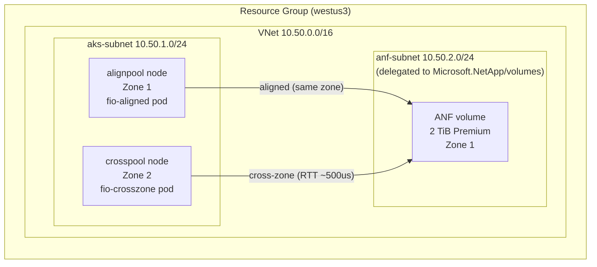

# Azure Shared Storage IOPS Test Lab (AKS variant)

Reproduces the ANF cross-zone IOPS investigation on **AKS** — the platform the
customer actually runs — instead of standalone VMs. Where the
[VM lab](../README.md) isolates the network variable on dedicated VMs, this lab
answers the **platform-fidelity** questions that only AKS can:

1. **Does the cross-zone penalty reproduce through the AKS / NFS mount path**
   (pods, kubelet-mounted PV, zone scheduling), not just on bare VMs?
2. **What NFS mount options does the pod actually get?** (the `nconnect`
   question — see *CSI mount-option fidelity* below). This is the single
   highest-value check, because if the mount path drops `nconnect`, AKS
   numbers can differ from the VM lab even when perfectly zone-aligned.
3. **Does the zone-affinity fix work end-to-end?** Pinning a pod to the ANF
   zone should restore aligned IOPS.

> The physics (inter-zone RTT, and the sync-vs-async regime split) is already
> settled in [Storage-CrossZone-Findings.md](../Storage-CrossZone-Findings.md).
> This lab is about confirming it on AKS and validating the remediation — not
> re-proving the penalty exists.

---

## What gets deployed

| Resource | Purpose |
|---|---|
| VNet `10.50.0.0/16` with `aks-subnet` + delegated `anf-subnet` | Same in-VNet (cross-zone) network path the VM lab used |
| AKS cluster (CNI overlay) | The platform under test |
| `systempool` (1 × `D4s_v5`, aligned zone) | Tiny system pool |
| `alignpool` (1 × `D8s_v5`, **ANF zone**) — label `lab-role=aligned` | Best-case node pool |
| `crosspool` (1 × `D8s_v5`, **different zone**) — label `lab-role=crosszone` | Worst-case node pool |
| ANF account / pool / **2 TiB NFSv4.1 volume** pinned to the aligned zone | The volume under test |
| Azure Files **NFS** Premium share | Optional zone-insensitive comparison |

Two fio Jobs run the **same workload** the VM lab used (4 KiB, 75/25 randrw,
`iodepth=64`), each pinned to one node pool via `nodeSelector: lab-role`.



---

## Prerequisites

- Azure CLI (`az`) logged in, with Owner/Contributor on the subscription
- `kubectl` and `jq`
- The ANF resource provider registered (the deploy script does this)

---

## Run it

### 1. Deploy infrastructure

```bash
# bash
bash infra/deploy.sh \
  --subscription <SUB_ID> \
  --resource-group rg-storage-iops-aks
```

```powershell
# PowerShell
./infra/deploy.ps1 -Subscription <SUB_ID> -ResourceGroup rg-storage-iops-aks
```

Outputs (cluster name, ANF mount IP/path, zones) are written to
`infra/lab-output.json`.

### 2. Run the cross-zone fio experiment

```bash
bash scripts/run-aks-tests.sh --resource-group rg-storage-iops-aks
```

This pulls AKS credentials, substitutes the ANF mount IP/path into the static
PV, applies the ConfigMap + PV + PVC, then runs the **aligned** and
**cross-zone** Jobs and streams each one's logs. Each job prints:

- the **node + zone** it landed on,
- the **actual NFS mount options** (fidelity check),
- **burst / sustained (psync) / async (libaio)** IOPS.

Expected shape (from the VM lab):

| Variant | Aligned | Cross-zone |
|---|---|---|
| psync (sync) | ~12k–14k read | ~4k read (**~3× penalty**) |
| libaio (async) | ~24k read | ~24k read (**no penalty**) |

### 3. (Optional) Inspect the mount options directly

```bash
bash scripts/inspect-mount.sh
```

Spins a throwaway pod on each pool and dumps `nfsstat -m` / `mount`. Look for
`nconnect=8` and `rsize/wsize=262144`.

### 4. Tear down

```bash
bash scripts/cleanup.sh            # uses lab-output.json
# or
./scripts/cleanup.ps1 -ResourceGroup rg-storage-iops-aks
```

---

## CSI mount-option fidelity (why the static PV)

This lab mounts the ANF volume with a **static NFS `PersistentVolume`** whose
`mountOptions` are set explicitly to match the VM lab
(`vers=4.1,nconnect=8,rsize=262144,wsize=262144,hard,timeo=600,retrans=2`).
That makes the AKS numbers directly comparable to
[Storage-CrossZone-Findings.md](../Storage-CrossZone-Findings.md).

In production, customers typically mount ANF through a **CSI driver**
(Astra Trident, or the managed Azure NetApp Files CSI driver) via dynamic
provisioning. Those drivers choose their own mount options, and **may not set
`nconnect`** unless explicitly configured. If they don't, a perfectly
zone-aligned pod can still under-perform the VM baseline — a failure mode the
VM lab cannot surface.

To check this for a customer:

1. Deploy their CSI driver / StorageClass and provision a volume dynamically.
2. Run `scripts/inspect-mount.sh` (or `nfsstat -m` in any pod using that PVC).
3. Compare the options against the static PV here. If `nconnect` is missing
   or `rsize/wsize` differ, that is a configuration finding independent of the
   cross-zone question — fix it in the StorageClass `mountOptions`.

---

## How this maps to the customer's setup

| Dimension | Customer (reported) | This AKS lab |
|---|---|---|
| Compute | AKS pod | AKS pod |
| Mount path | CSI / NFS | Static NFS PV (explicit options) + optional CSI compare |
| Zone variation | Node pools across AZs | `alignpool` (ANF zone) vs `crosspool` (other zone) |
| Workload | fio 4 KiB 75/25 randrw `iodepth=64` | Identical |
| Multi-backend in one pod | Yes (3 mounts in parallel) | Isolated per Job by default (add a second PVC/Job to reproduce contention) |

> **Reproducing the customer's parallel-pod contention.** The customer drives
> three mounts from one pod simultaneously, which lowers their *absolute*
> numbers (shared pod CPU/network) without changing the cross-zone *ratio*. To
> mirror that, add the Azure Files NFS share as a second static PV and run both
> fio targets in a single pod. The default Jobs here keep backends isolated so
> the zone signal stays clean.
